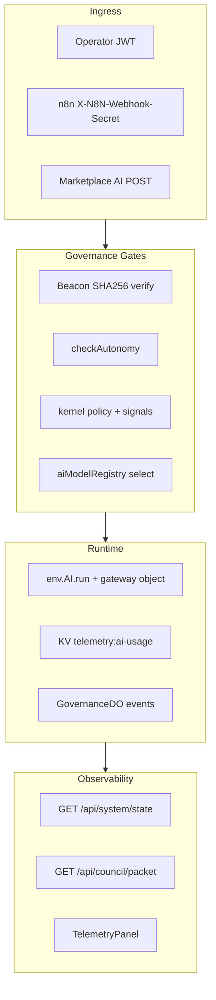

# MSHOPS.NET AI Gateway — Operational Doctrine

**Gateway ID:** `mshops-net-governance`  
**Account:** `f02eebce2a5c46b33b0d204f3cd4950a`  
**Worker binding:** `AI` (Workers AI + AI Gateway object)  
**Constitution:** Northstar Beacon (`msh-ops/beacon/northstar.json`)  
**Entry point:** `worker/aiGateway.ts` → `runGovernedInference()`



---

## 1. Gateway Purpose and Philosophy

### 1.1 Mission

The MSHOPS.NET AI Gateway is **not** an autonomous agent mesh. It is a **governance-first inference boundary** that:

- Routes all LLM calls through Cloudflare AI Gateway (`mshops-net-governance`)
- Enforces Northstar Beacon alignment before any token is spent
- Records usage, denials, and governance events in KV
- Exposes advisory-only marketplace intelligence
- Feeds council oversight via read-only packets

### 1.2 Core principles

| Principle | Implementation |
|-----------|----------------|
| **Governance-first routing** | Every call passes `verifyBeaconHash` → `checkAutonomy` → policy overlay → model selection before `env.AI.run()` |
| **Beacon alignment** | Axis (`STABILITY` → `REVENUE_VALIDATION` → `TRUST` → `CONTROLLED_GROWTH` → `WILDCARD_INNOVATION`) declared per request; `northstar_alignment` attached to every success response |
| **Bounded autonomy** | Three action kinds only: `advisory`, `mutate_state`, `autonomous_execute`. No agent-to-agent recursion. Batch cap: 3 concurrent |
| **Marketplace intelligence** | Five advisory POST routes; never mutates entitlements or processes purchases |
| **Council oversight** | `GET /api/council/packet` returns `advisoryOnly: true`; escalations return `councilAdvisory: true` on 409 |

### 1.3 What the gateway does NOT do

- Does not mutate `msh-ops/beacon/northstar.json` (MCP proposals are log-only)
- Does not bypass operator auth on protected routes (except n8n with shared secret)
- Does not expose `/api/ai/*` on `mshops-public` surface
- Does not run autonomous orchestration loops or TTX live-session streaming inference

---

## 2. Routing and Model Selection Doctrine

### 2.1 Model profiles (`worker/aiModelRegistry.ts`)

| Profile | Beacon axis | Primary models | Cache | Max tokens |
|---------|-------------|----------------|-------|------------|
| `stability` | STABILITY | `@cf/meta/llama-3.1-8b-instruct`, `@cf/mistral/mistral-small-3.1-24b-instruct` | 3600s TTL | 1024 |
| `revenue` | REVENUE_VALIDATION | `@cf/moonshotai/kimi-k2.6`, `openai/gpt-4.1-mini` | skip | 2048 |
| `trust` | TRUST | `@cf/meta/llama-guard-3-8b`, `@cf/meta/llama-3.1-8b-instruct` | 3600s TTL | 1024 |
| `growth` | CONTROLLED_GROWTH | `@cf/meta/llama-3.3-70b-instruct`, `@cf/moonshotai/kimi-k2.6` | 3600s TTL | 2048 |
| `wildcard` | WILDCARD_INNOVATION | `@cf/moonshotai/kimi-k2.6` | skip | 2048 |

### 2.2 Agent routing table

| Agent ID | Profile | Default action kind | Surface |
|----------|---------|---------------------|---------|
| `OrganizerAgent` | stability | advisory | organizer |
| `AiAgentBuilderAgent` | growth | advisory | fulfillment |
| `SecurityRemediationAgent` | trust | advisory | fulfillment |
| `RagArchitectureAgent` | growth | advisory | fulfillment |
| `LocalAiDeploymentAgent` | stability | advisory | fulfillment |
| `NorthstarBeaconGovernanceApp` | trust | advisory | fulfillment |
| `GuideAgent` | stability | advisory | cockpit |
| `GhostLayer` | wildcard | advisory | ghost |
| `CockpitTtxAssist` | stability | advisory | cockpit |
| `PiecesOsMcpIngest` | stability | advisory | — |
| Unknown agent | stability (fallback) | — | — |

### 2.3 Marketplace routing table

| Route | Profile | Axis | Agent ID pattern |
|-------|---------|------|------------------|
| `POST /api/ai/marketplace/product-analysis` | revenue | REVENUE_VALIDATION | `MarketplaceAi:product-analysis` |
| `POST /api/ai/marketplace/fraud-score` | trust | TRUST | `MarketplaceAi:fraud-score` |
| `POST /api/ai/marketplace/purchase-validate` | revenue | REVENUE_VALIDATION | `MarketplaceAi:purchase-validate` |
| `POST /api/ai/marketplace/revenue-validate` | revenue | REVENUE_VALIDATION | `MarketplaceAi:revenue-validate` |
| `POST /api/ai/marketplace/behavior-analysis` | trust | TRUST | `MarketplaceAi:behavior-analysis` |

All marketplace routes: `actionKind: advisory` only, `surface: marketplace`, cache always skipped.

### 2.4 Policy-driven model selection

`selectModelForProfile()` applies overlays in this order:

1. `wildcardFeaturesEnabled === false` → downgrade `wildcard` to `stability`
2. `policy.mode === RESTRICTIVE` → force `stability` profile
3. `ERROR_STATE` signal → Workers AI (`@cf/*`) only; strip third-party fallbacks
4. `HIGH_RISK` signal → smallest stability model; cap `max_tokens` at 512
5. `preferredModel` in request body → used only if in profile allowlist

### 2.5 Cache doctrine

Cache is **skipped** when any of:

- `actionKind !== advisory`
- Profile has `skipCache: true` (revenue, wildcard)
- `policy.mode === RESTRICTIVE`

Gateway metadata (`cf-aig-metadata`) is attached on REST fallback path with: `agentId`, `actionKind`, `axis`, `beaconHash`, `policyMode`, `profile`, `surface`, `operatorCallsign`, `sessionId`, `proposalId`.

### 2.6 Batch inference boundaries (`worker/aiBatch.ts`)

- Maximum **3 concurrent** `runGovernedInference` calls per batch
- Each sub-call runs full governance stack independently
- Exceeding 3 items throws before execution
- No nested batching (recursion depth = 1)
- Batch module is library-ready; no HTTP route exposes it yet

### 2.7 Safe-mode routing

When `ctx.safeMode === true` (`msh-ops/governance/checkAutonomy.ts`):

- `advisory` → allowed (stability profile after overlay)
- `mutate_state` / `autonomous_execute` → denied at `runGovernedInference` with `BEACON_SAFE_MODE` (403)

---

## 3. Governance Enforcement Doctrine

### 3.1 Pre-inference gate sequence

Every `runGovernedInference()` call executes in order:

```
1. verifyBeaconHash(ctx.integrityHash vs EXPECTED_BEACON_SHA256)
2. isAgentBlocked(agentId) — KV key ai-gateway:block:{agentId}
3. checkAutonomy(proposal, ctx)
4. safeMode non-advisory block
5. resolveAgentProfile + selectModelForProfile
6. env.AI.run() or REST fallback
7. recordAiGatewayUsage + recordGovernanceEvent("ai_inference")
```

### 3.2 Beacon SHA256 verification

- **Var:** `EXPECTED_BEACON_SHA256` in `wrangler.jsonc` (mirrors `msh-ops/beacon/beacon.hash`)
- **Failure code:** `BEACON_INTEGRITY_FAIL` (403)
- **Operator action:** Re-run `node scripts/compute-beacon-hash.mjs` after beacon release; update var in all wrangler configs; redeploy

### 3.3 Autonomy check outcomes

| Decision | HTTP | Code | Council flag |
|----------|------|------|--------------|
| allowed | proceed | — | — |
| denied | 403 | `BEACON_AUTONOMY_DENIED` | no |
| escalate | 409 | `BEACON_AUTONOMY_ESCALATE` | `councilAdvisory: true` |

**Action kind rules:**

- `advisory` — allowed (unless safe mode blocks non-advisory at gateway layer)
- `mutate_state` — requires `operator_approval: true` or `operatorApprovalToken`
- `autonomous_execute` — requires explicit operator approval; denied without it

### 3.4 Rate abuse protection

- Denials recorded in KV `ai-gateway:denials:{agentId}` (60s window)
- **>5 denials/minute** → temporary block (`ai-gateway:block:{agentId}`, 60s TTL)
- Blocked agents receive `AI_GATEWAY_RATE_ABUSE` (429)
- Governance event: `ai_gateway_rate_abuse`

### 3.5 MCP signal ingestion

**Route:** `POST /api/ai/mcp/signal`  
**Flow:** `validateMcpPayload()` → `ingestMcpPayload()` → proposal logged  
**Hard rule:** `mutationApplied: false` always — beacon file never written  
**Policy tightening:** `severity: high|medium` → KV key `ai-gateway:mcp-strict-signal` (1h TTL)

### 3.6 Authentication rules

| Caller | Auth mechanism | Constraints |
|--------|----------------|-------------|
| Operator (cockpit, dashboard) | `Authorization: Bearer <JWT>` | Full infer params; any declared `actionKind` |
| n8n automation spine | `X-N8N-Webhook-Secret` header | Forces `actionKind: advisory`, `axis: STABILITY`, `surface: n8n` |
| Public surface | — | All `/api/ai/*` blocked (403) |
| Marketplace AI | Operator JWT (via edge route class) | Advisory only |

**Protected routes** (`worker/edge/routeClass.ts`): `/api/ai/infer`, `/api/ai/usage`, `/api/ai/mcp/signal`, `/api/ai/marketplace/*`, `/api/council/packet`, `/api/telemetry/events`

### 3.7 Denial logging

Every denial triggers:

- `recordAiGatewayDenial()` → increments `denialCount` in `telemetry:ai-usage`
- `recordGovernanceEvent("ai_gateway_denial", { agentId, reason })`
- Possible agent block (see 3.4)

---

## 4. Marketplace Intelligence Doctrine

### 4.1 Philosophy

Marketplace AI routes produce **advisory narratives only**. They do not:

- Process purchases (existing `/api/marketplace/purchase*` gate + engine proxy unchanged)
- Write entitlements to MarketplaceDO
- Store PII in fraud signal logs

### 4.2 Flow per route

**Product analysis**

- Input: `itemId` or `id` in JSON body
- Data source: `worker/catalogData.ts` `CATALOG_ITEMS`
- Output: tags, tier, positioning suggestions

**Fraud score**

- Input: purchase intent signals (operator-provided JSON)
- Prompt constraint: "advisory only, no PII"
- Telemetry: `telemetry:ai-fraud-signals` KV key on completion

**Purchase validate**

- Input: entitlement + intent payload
- Axis: REVENUE_VALIDATION
- Complements (does not replace) `enforceMarketplaceGovernance()` on purchase routes

**Revenue validate**

- Input: operator payload + auto-enriched `usage` + `behavior` from `worker/usage.ts` and `worker/behaviorIntelligence.ts`
- Axis: REVENUE_VALIDATION

**Behavior analysis**

- Same enrichment as revenue validate
- Axis: TRUST
- Classifies conversion patterns from usage beacons

### 4.3 Governance gate for marketplace AI paths

In `worker/index.ts`, `/api/ai/marketplace/*` requests pass through:

1. `enforceGovernancePolicy()` (wildcard block if policy disabled)
2. `enforceMarketplaceGovernance()` when `mandate-marketplace` is approved

### 4.4 Telemetry ingestion

- `recordMarketplaceAiEvent(env, routeKey, success)` → KV `telemetry:marketplace-ai` (last 100 events, 7d TTL)
- Fraud route additionally writes `telemetry:ai-fraud-signals`
- Success/failure counts feed `SystemState.aiGateway.gatewayHealth`

---

## 5. Telemetry and Observability Doctrine

### 5.1 KV keys

| Key | Content | TTL |
|-----|---------|-----|
| `telemetry:ai-usage` | Rollup: tokens, cost estimate, byAgent, byProfile, denialCount | 7d |
| `telemetry:marketplace-ai` | Per-route success/failure events | 7d |
| `telemetry:ai-fraud-signals` | Latest fraud-score advisory result | 7d |
| `telemetry:governance-events` | ai_inference, ai_gateway_denial, ai_gateway_rate_abuse | 7d |
| `ai-gateway:denials:{agentId}` | Denial timestamps (rate abuse) | 120s |
| `ai-gateway:block:{agentId}` | Block-until timestamp | 120s |
| `ai-gateway:mcp-strict-signal` | MCP severity overlay marker | 1h |

### 5.2 Usage rollup schema (`AiUsageRollup`)

```ts
{
  promptTokens, completionTokens, totalTokens,
  costEstimateUsd,        // ~0.0001 per token (heuristic)
  requestCount, denialCount,
  byAgent: Record<string, number>,
  byProfile: Record<string, number>,
  updatedAt, environment
}
```

### 5.3 API observability endpoints

| Endpoint | Returns |
|----------|---------|
| `GET /api/ai/usage` | Full `AiUsageRollup` |
| `GET /api/telemetry/events` | Governance events + `aiUsage` rollup |
| `GET /api/system/state` | `state.aiGateway` block |
| `GET /api/council/packet` | Advisory council bundle |

### 5.4 SystemState.aiGateway (`worker/kernel.ts`)

```ts
aiGateway: {
  usageRollup,           // from getAiUsageRollup()
  policyMode,            // effective policy after signal overlay
  gatewayHealth,         // "ok" | "degraded" | "unavailable"
  recentDenials          // usageRollup.denialCount
}
```

**Health logic:** `degraded` when `denialCount > requestCount` (and at least one request exists).

### 5.5 Dashboard integration

- `src/lib/useTelemetry.ts` polls `api.getAiUsage` every 30s
- `src/components/TelemetryPanel.tsx` displays inference count, token total, denial count, gateway health
- `src/lib/telemetryService.ts` `getEvents()` now resolves against Worker KV (no longer engine-dependent stub)

### 5.6 Council packet assembly (`worker/councilPacket.ts`)

Read-only bundle containing:

- Beacon summary (id, axis, integrityHash, safeMode)
- `policyMode`
- Full `aiUsage` rollup
- Recent governance events (from extended telemetry)
- Pending MCP proposals (`pending_operator_approval` only)
- `advisoryOnly: true` (immutable flag)

### 5.7 Cloudflare dashboard logs

Gateway `mshops-net-governance` configured via `scripts/provision-ai-gateway.mjs`:

- `collect_logs: true`
- Rate limit: 100 req/min (fixed window)
- Cache TTL default: 3600s
- Per-request metadata via `cf-aig-metadata` on REST path

---

## 6. Safe-Mode Doctrine

### 6.1 Triggers

| Trigger | Source | Effect |
|---------|--------|--------|
| Beacon tampered | `assertBeaconOnStartup()` | Worker refuses boot (production) |
| Test safe mode | `allowSafeMode: true` in tests | Advisory-only stub beacon |
| `ctx.safeMode === true` | `msh-ops/beacon/loadBeacon.ts` | Non-advisory inference blocked |
| `HIGH_RISK` ghost signal | `worker/policyResponse.ts` | Wildcard disabled; smallest model; 512 token cap |
| `ERROR_STATE` telemetry | policy overlay | Workers AI only |
| `RESTRICTIVE` policy mode | signal overlay | Force stability profile; skip cache |
| MCP high/medium severity | `ai-gateway:mcp-strict-signal` | Operator review signal (1h marker) |

### 6.2 Routing changes under stress

```
standard → strict     (PERFORMANCE_DEGRADED)
standard → RESTRICTIVE (HIGH_RISK)
wildcard → stability   (wildcardFeaturesEnabled=false OR RESTRICTIVE)
third-party → @cf/* only (ERROR_STATE)
max_tokens → 512      (HIGH_RISK)
```

### 6.3 Agent restrictions in safe mode

- `mutate_state` / `autonomous_execute` → `BEACON_SAFE_MODE` (403) at gateway
- `advisory` → permitted through stability profile
- Ghost AI summary → suppressed when `HIGH_RISK` or `LOW_INTELLIGENCE` (`worker/ghostAiSummary.ts`)
- Batch inference → each item still individually gated; no bypass

### 6.4 Marketplace restrictions

- Marketplace AI always advisory — safe mode does not add extra block beyond standard autonomy
- When `mandate-marketplace` approved: purchase routes still gated by `enforceMarketplaceGovernance()` independently
- Fraud/revenue routes skip PII; no additional safe-mode PII handling needed

### 6.5 Council escalation

- `BEACON_AUTONOMY_ESCALATE` (409) responses include `councilAdvisory: true`
- Operator reviews via `GET /api/council/packet` and GovernanceDO event log
- AI Council is advisory only per beacon authority block — no auto-remediation

---

## 7. Fulfillment Enrichment Doctrine

### 7.1 Toggle

**Var:** `AI_FULFILLMENT_ENABLED` in wrangler (`"false"` default)  
**Module:** `worker/aiFulfillmentEnrichment.ts` → `maybeEnrichWithAi()`

### 7.2 When enrichment runs

All conditions required:

1. `AI_FULFILLMENT_ENABLED === "true"` or `"1"`
2. `env.AI` binding available (or REST token configured)
3. Fulfillment `handleGenerateWithGovernance()` passes `env` + `enrichmentPrompt`
4. Base deterministic spec already generated
5. `checkAutonomy` allows advisory action for the agent

Enrichment adds `ai_enrichment` and `ai_model` fields to fulfillment response. Queue recording (`mutate_state`) still requires `operator_approval: true`.

### 7.3 When enrichment is forbidden

- `AI_FULFILLMENT_ENABLED` not set → returns base result unchanged
- Inference failure → `ai_enrichment: undefined` (silent degrade; base spec preserved)
- Safe mode non-advisory paths → N/A (enrichment uses advisory only)
- Gateway unavailable (`AI_GATEWAY_UNAVAILABLE`) → no enrichment fields

### 7.4 Operator override rules

- Enrichment does not bypass `operator_approval` for queue entries
- Operator cannot force enrichment without enabling the var at deploy time
- Operator JWT required for fulfillment routes on operator-classified paths

### 7.5 Affected fulfillment agents

All four generate routes in `worker/fulfillmentAgentRoutes.ts`:

- `/api/ai-agent-build-spec-generate`
- `/api/security-remediation-plan-generate`
- `/api/rag-architecture-plan-generate`
- `/api/local-ai-deployment-plan-generate`

---

## 8. Operational Procedures

### 8.1 Provisioning

```bash
# Dry run (no API calls)
node scripts/provision-ai-gateway.mjs --dry-run

# Create or update gateway
CF_API_TOKEN=<token> node scripts/provision-ai-gateway.mjs
```

Creates/updates `mshops-net-governance` with logging, 100 req/min rate limit, 3600s cache TTL.

### 8.2 Secret management

| Secret | Purpose | Set via |
|--------|---------|---------|
| `CF_AI_API_TOKEN` | REST fallback to AI Gateway API | `wrangler secret put CF_AI_API_TOKEN` |
| `N8N_WEBHOOK_SECRET` | n8n spine auth for `/api/ai/infer` | `wrangler secret put N8N_WEBHOOK_SECRET` |

**Never** place secrets in `wrangler.jsonc`. Browser clients never receive CF tokens.

**Dev tokens:** `npx wrangler auth token` (short-lived OAuth) for local curl testing only.

### 8.3 Deployment sequence

```bash
# 1. Provision gateway (once per account)
node scripts/provision-ai-gateway.mjs

# 2. Set secrets (per environment)
npx wrangler secret put CF_AI_API_TOKEN --env staging
npx wrangler secret put N8N_WEBHOOK_SECRET --env staging

# 3. Build and deploy
npm run build
npx wrangler deploy --env staging

# 4. Smoke test
npm run verify:ai-gateway -- https://ttx-operator-shell-staging.sogellagepul.workers.dev

# 5. With operator token for full checks
OPERATOR_BEARER_TOKEN=<jwt> npm run verify:ai-gateway -- <staging-url>

# 6. Promote to production after manual smoke
npm run deploy
```

### 8.4 Verification checklist

`scripts/verify-ai-gateway.mjs` validates:

- `GET /api/ai/usage` — 200 (authed) or 401 (unauthed)
- `GET /api/council/packet` — `advisoryOnly: true`
- `GET /api/telemetry/events` — events array present
- `POST /api/ai/infer` without auth — 401
- `GET /api/system/state` — `aiGateway` block present

### 8.5 Rollback

Per `ROLLBACK.md`:

```bash
npx wrangler rollback
# or
npx wrangler versions rollback
```

Rollback removes AI routes but does not delete KV telemetry history (7d TTL).

### 8.6 Beacon release procedure

When `msh-ops/beacon/northstar.json` changes:

1. Run `node scripts/compute-beacon-hash.mjs`
2. Update `EXPECTED_BEACON_SHA256` in all wrangler configs
3. Redeploy all surfaces (storefront, staging, mshops-operator)
4. Verify `BEACON_INTEGRITY_FAIL` does not appear in governance events

### 8.7 Enabling fulfillment enrichment

1. Confirm `CF_AI_API_TOKEN` or `AI` binding works (`POST /api/ai/infer` smoke test)
2. Set `AI_FULFILLMENT_ENABLED: "true"` in wrangler vars
3. Redeploy
4. Monitor `telemetry:ai-usage` for fulfillment agent IDs

### 8.8 Ghost summary procedure

Optional AI narrative on ghost telemetry:

```
GET /api/ghost/telemetry?aiSummary=1
```

Requires `env.AI` binding, stable wildcard policy, no `HIGH_RISK`/`LOW_INTELLIGENCE` signals. Returns `aiSummary: string | null` in response.

### 8.9 Audit trail sources

| Source | Retention | Contents |
|--------|-----------|----------|
| KV `telemetry:governance-events` | 7d | ai_inference, ai_gateway_denial, ai_gateway_rate_abuse |
| GovernanceDO event log | permanent | Mirrored governance events |
| Cloudflare AI Gateway dashboard | per account settings | Request metadata via `cf-aig-metadata` |
| Council packet | point-in-time | Snapshot for operator review |

---

## 9. API Quick Reference

### POST /api/ai/infer

```json
{
  "agentId": "GuideAgent",
  "axis": "STABILITY",
  "actionKind": "advisory",
  "messages": [{ "role": "user", "content": "..." }],
  "surface": "cockpit",
  "operator_approval": false,
  "model": "@cf/meta/llama-3.1-8b-instruct",
  "maxTokens": 512,
  "sessionId": "optional",
  "proposalId": "optional"
}
```

### POST /api/ai/mcp/signal

Pieces OS governance payload per `msh-ops/mcp/validateMcpPayload.ts`. Returns `mutationApplied: false`.

### n8n spine call

```http
POST /api/ai/infer
X-N8N-Webhook-Secret: <N8N_WEBHOOK_SECRET>
Content-Type: application/json

{ "messages": [{ "role": "user", "content": "..." }] }
```

Forces `GuideAgent`-equivalent advisory on `STABILITY` axis.

---

## 10. Error Code Reference

| Code | HTTP | Meaning | Operator action |
|------|------|---------|-------------------|
| `BEACON_INTEGRITY_FAIL` | 403 | Hash mismatch | Update `EXPECTED_BEACON_SHA256`, redeploy |
| `BEACON_AUTONOMY_DENIED` | 403 | Autonomy gate denied | Review axis/approval |
| `BEACON_AUTONOMY_ESCALATE` | 409 | Needs operator approval | Review council packet |
| `BEACON_SAFE_MODE` | 403 | Non-advisory in safe mode | Wait for beacon restore |
| `AI_GATEWAY_RATE_ABUSE` | 429 | Agent temporarily blocked | Wait 60s; investigate denials |
| `AI_GATEWAY_UNAVAILABLE` | 503 | No AI binding or token | Set secrets, verify binding |
| `AI_GATEWAY_UPSTREAM_ERROR` | 502/4xx | Cloudflare API failure | Check dashboard, model availability |
| `AI_GATEWAY_EXECUTION_ERROR` | 502 | Runtime exception | Check Worker logs |

---

## 11. Surface Deployment Matrix

| Config | AI routes | Notes |
|--------|-----------|-------|
| `wrangler.jsonc` | Full | Primary storefront + cockpit |
| `env.staging` | Full | `OPERATOR_BETA` mode |
| `wrangler.mshops-operator.jsonc` | Full | Operator surface |
| `wrangler.mshops-public.jsonc` | **Blocked** | `MSHOPS_SURFACE=public` returns 403 on `/api/ai/*` |

---

**Doctrine version:** 1.0 — aligned to implemented Worker layer as of gateway integration phase.  
**Authority:** Operator retains full execution authority. AI Council and all gateway outputs are advisory only.
