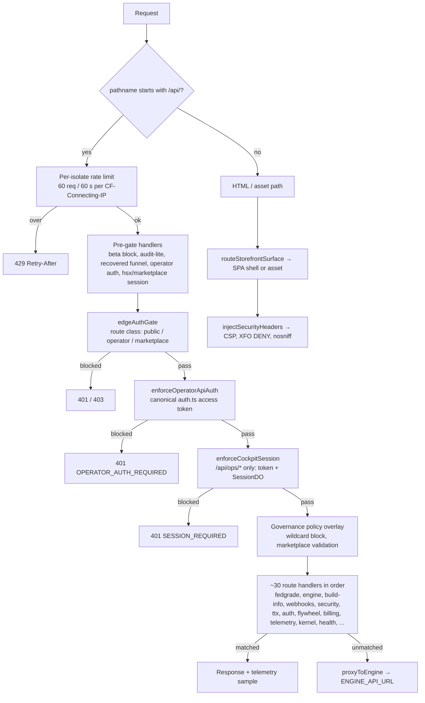

# Architecture — MSH OPS Operator Shell

**Date:** 2026-09-17 · **Task:** 4 of `docs/BUDGET-EXECUTION-PLAN.md` · **Branch:** `claude/eloquent-heisenberg-p2i54y`

Derived from the code as it exists (`worker/index.ts`, `worker/surface.ts`, `worker/surfaceSpa.ts`, `worker/kernel.ts`, `wrangler*.jsonc`). Nothing here is speculative; anything not determinable from the repo is marked UNKNOWN. Pair with `CLAUDE.md` (orientation) and `docs/security/AUTH-SESSION-REVIEW.md` (trust boundaries).

## 1. Deployment topology

One codebase (`worker/index.ts`) deploys as three Workers, distinguished only by the `MSHOPS_SURFACE` var:

| Worker | Config | `MSHOPS_SURFACE` | `resolveSurfaceMode` | Role |
|---|---|---|---|---|
| `ttx-operator-shell` | `wrangler.jsonc` | unset | `storefront` | Primary: all surfaces, all API routes, all bindings |
| `ttx-operator-shell-staging` | `wrangler.jsonc` `env.staging` | unset | `storefront` | Same code, own KV namespaces, `SYSTEM_MODE=OPERATOR_BETA` |
| `mshops-operator` | `wrangler.mshops-operator.jsonc` | `operator` | `operator` | Operator SPA surface |
| `mshops-public` | `wrangler.mshops-public.jsonc` | `public` | `public` | Public edge; redirects non-API traffic to the canonical entry |

`msh-ops-os-harness` is a separate Worker, not built from this repo. It is reached two ways: as `ENGINE_API_URL` over HTTPS (the `/api/*` proxy fall-through) and as the `HARNESS` service binding (`worker/ghost.ts`). Its internals are UNKNOWN here.

## 2. Request lifecycle

Ordering facts that matter:

- The rate limiter is an in-isolate `Map`, 60 requests per 60 s per client IP (`index.ts:103-133`). It is per isolate and per colo, so it bounds a single hot isolate, not a distributed flood.
- Three gates run in sequence before any handler: the edge gate (route-class JWT), canonical auth (`auth.ts` access token), and the cockpit session gate (`/api/ops/*` plus `SessionDO`).
- Since the F1 remediation (`a58003e`), operator-class routes must clear **both** the edge gate and canonical auth. Only marketplace-class routes remain edge-gate-only, because they carry the ctx-hash binding.
- Any `/api/*` path that no handler claims is proxied to `ENGINE_API_URL` with the client's original headers plus `X-Forwarded-Host` and `X-Forwarded-Proto`. The proxy is the last step, so gate coverage decides what reaches the harness.
- Every API response records a telemetry sample (path, latency, status) into `TTX_STATE`.

### Worked example: `GET /api/ops/fedgrade`

1. Rate limit check passes.
2. `classifyRoute` returns `public` (it is not in `OPERATOR_PROTECTED`), so `edgeAuthGate` does not challenge.
3. `enforceOperatorApiAuth` finds it is not allowlisted in `isPublicApiRoute`, so it requires an `auth.ts` access token. No token → 401 `OPERATOR_AUTH_REQUIRED`.
4. `enforceCockpitSession` matches the `/api/ops` prefix: it re-reads the operator from the token, fetches or creates the operator's `SessionDO` record, and validates it. Failure → 401 `SESSION_REQUIRED` or `SESSION_INVALID`.
5. Kernel policy overlay runs, then the matching handler produces the response and a telemetry sample.

## 3. Surfaces and static assets

Non-API traffic never touches the API gates. `routeStorefrontSurface` resolves each path to an isolated SPA shell, falling back to the assets binding:

| Surface | Shell | Routes |
|---|---|---|
| Ecosystem | `ecosystem-shell.html` | `/` |
| Cockpit | `operator-shell.html` | `/dashboard`, `/ttx`, `/systems`, `/ops`, `/status` |
| Auth | `auth-shell.html` | `/login` |
| Council | `council-shell.html` | `/council` |
| Storefront | `app/index.html` | `/marketplace`, `/storefront` |

Anything with a file extension, or matching a recovered public route, is served directly from `ASSETS`. `not_found_handling` is `single-page-application`, so unknown paths return a shell rather than a 404. Security headers (CSP, `X-Frame-Options: DENY`, `nosniff`) are injected on HTML responses by `worker/edge/headers.ts`. Authentication for cockpit **documents** is client-side (`RequireAuth` redirects to `/login`); the server never session-gates an HTML navigation, because browsers do not send `Authorization` on document requests. That split is deliberate and is asserted by `tests/cockpitSessionBoundary.test.ts`.

## 4. Module groups and dependencies

`worker/` is about 14 000 lines across ~80 modules. The dependency shape, derived from imports:

- **`index.ts`** imports every route module and owns ordering. It is the only place the gate sequence is expressed, so a new protected route added elsewhere is not protected until it is placed correctly here.
- **`kernel.ts`** is the convergence point: it imports `auth`, `sessionBridge`, `governance`, `telemetry`, `ghost`, `usage`, `adaptation`, `experimentation`, `behaviorIntelligence`, `policyResponse`, and `governanceAutomation`, and exposes `resolveEffectiveKernelContext`, `buildSystemState`, `enforceCockpitSession`, `enforceGovernancePolicy`, and `enforceMarketplaceGovernance`. Most intelligence modules are leaves that only the kernel and their own route wrapper import.
- **`edge/`** (`gate`, `routeClass`, `crypto`, `rateLimit`, `headers`) is a self-contained port of the live `mshops-public` edge worker, recorded in `edge/canonical/source-meta.ts`. It has its own JWT implementation, separate from `auth.ts`.
- **`do/`** holds the Durable Object classes; `sessionBridge.ts` is the only typed client for `SessionDO`, and the DO is addressed by the fixed name `operator`.
- **`shared/flywheel/`** (contracts, events, stages) is imported by both `worker/flywheel/` and `src/components/flywheel/`, making it the one real contract boundary between Worker and UI.

## 5. State and bindings

| Binding | Kind | Used for | Consistency |
|---|---|---|---|
| `ASSETS` | Static assets | SPA shells, public pages | n/a |
| `AUTH_REVOCATION` | KV | Revoked refresh-token `jti` denylist | Eventually consistent (see F6) |
| `SECURITY_EVENTS` | KV | Auth-failure and invalid-token signals, capped at 50 | Eventually consistent |
| `WEBHOOK_EVENTS` | KV | Inbound webhook records | Eventually consistent |
| `TTX_STATE` | KV | TTX sessions, telemetry samples, subsystem failure log | Eventually consistent |
| `GOVERNANCE` | Durable Object | Northstar state, mandates, strategic axis | Strong, single instance |
| `SESSION` | Durable Object | Operator sessions, 12 h TTL, 10 per operator | Strong, single instance named `operator` |
| `MARKETPLACE` | Durable Object | Marketplace backbone state | Strong |
| `LIVE_TTX_SESSIONS` | Durable Object | Live TTX rooms, votes, participant roster | Strong, one per session |
| `RECEIPT_AUTHORITY` | Durable Object | Flywheel receipts | Strong |
| `FLYWHEEL` | Durable Object | Flywheel stage machine | Strong |
| `HARNESS` | Service binding | `msh-ops-os-harness` calls from `ghost.ts` | n/a |

Secrets (`OPERATOR_CALLSIGN`, `OPERATOR_PASSWORD_HASH`, `AUTH_SIGNING_KEY`, `OPERATOR_SECRET`, `MARKETPLACE_SECRET`, `HARNESS_SECRET`) are set with `wrangler secret put`, never in `vars`. Staging has its own KV namespace IDs; the Durable Object namespaces and `ENGINE_API_URL` are shared with production.

## 6. Failure modes

| Failure | Observed behavior | Fail-closed? | Evidence |
|---|---|---|---|
| `AUTH_SIGNING_KEY` unset | `/api/auth/*` returns 503; `getAccessTokenOperator` returns null, so protected routes 401 | Yes | `auth.ts:210,244,313,337` |
| `OPERATOR_SECRET` unset | Edge gate falls back to `AUTH_SIGNING_KEY`; if both unset, 503 | Yes, but see F5 key sharing | `edge/gate.ts:13-19,121` |
| `ENGINE_API_URL` unset | Proxy returns 503; local handlers unaffected | Yes | `index.ts:633-635` |
| Engine unreachable | Proxy returns 502 with the fetch error detail | Yes | `index.ts:650-658` |
| `GOVERNANCE` DO unreachable | `fetchGovernanceStateSafe` returns `defaultGovernanceState()` with `source: "fallback"`; `/api/system/health` reports `degraded` | No, degrades open to defaults | `kernel.ts:135-141`, `health.ts:87` |
| `SessionDO` create or validate fails | Cockpit API returns 401 `SESSION_INVALID`, and a subsystem failure is logged | Yes | `kernel.ts:296-330` |
| KV write fails | `recordSecurityEvent` logs to console and returns; telemetry swallows the error | No, telemetry is best-effort by design | `security.ts:58-63`, `telemetry.ts:156` |
| Asset shell missing or wrong | `serveOperatorSpa` inspects the HTML for operator markers and detects a storefront leak | Partly | `operator.ts:37-60` |
| `SYSTEM_MODE=OPERATOR_BETA` | `/api/lifecycle/advance*` returns 403 `BETA_AUTONOMOUS_BLOCKED`; staging only, production does not block | n/a | `mode.ts:39-56` |
| Rate limit exceeded | 429 with `Retry-After`, per isolate | Advisory only | `index.ts:113-133` |
| Unhandled exception | Top-level catch returns 500 `Internal error` and logs the pathname | Yes | `index.ts:146-160` |

The governance fallback is the one place the system degrades **open**: when the Durable Object is unreachable, policy is computed from defaults rather than refusing. That is visible in `/api/system/health` as `degraded`, and it is worth an Operator decision if policy is ever load-bearing for a destructive action.

## 7. Architectural observations

1. **Ordering is the security model.** There is no per-handler authorization convention. Whether a route is protected depends on its classification in `routeClass.ts` plus its position relative to the three gates in `index.ts`. A handler added before the gates is unauthenticated by construction. This is what made F1 possible.
2. **Two JWT implementations coexist** (`auth.ts` and `edge/crypto.ts`) with separate token shapes, lifetimes, and secret resolution. F5 tracks consolidation.
3. **`index.ts` is a 693-line linear dispatcher.** Adding a route means editing the chain, and the chain's order is not test-asserted end to end. A route-table test asserting gate position would make the ordering contract explicit.
4. **The proxy is an open tail.** Anything unmatched goes to the harness, so the local route table is not the system's full API surface. Gate coverage, not handler coverage, determines exposure.
5. **KV is used where linearizability is assumed.** Refresh-token single-use (F6) is the clearest case; `SessionDO` already provides the strong primitive that would fix it.

## 8. What is not determinable here

- Harness (`msh-ops-os-harness`) route table, authentication, and tenancy: UNKNOWN. It is not in this repo.
- Whether staging and production harness data are segregated by `FLYWHEEL_TENANT_ID`: UNKNOWN.
- Live values of any secret, and whether `OPERATOR_SECRET` is set in production: UNKNOWN by design.
