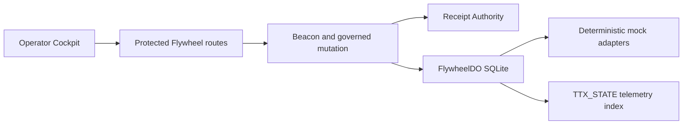

# Operator Flywheel Engine v1

The Flywheel is a Worker-first subsystem. Protected HTTP routes resolve the configured tenant, reuse the existing Beacon and governance services, and forward serialized state changes to one `FlywheelDO` instance named by `FLYWHEEL_TENANT_ID`.

The registry routes stages 1 through 10 and back to stage 1. Completing stage 10 creates a separate queued run and `flywheel.cycle.proposed` event. It never starts the new cycle. Activation uses `RESUME::FLYWHEEL::NEXT_CYCLE`, fresh evidence, policy validation, and C2 approval.

SQLite tables are `runs`, `executions`, `commands`, `events`, `metrics`, and `evidence`. One Durable Object per configured tenant serializes commands and idempotency decisions. V1 supports one configured tenant per deployment.
